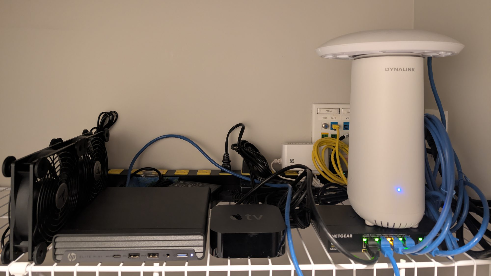
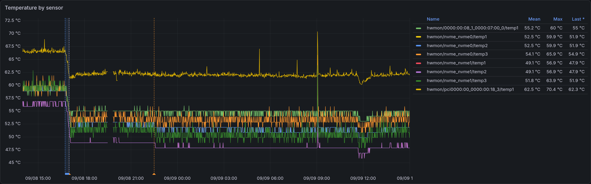
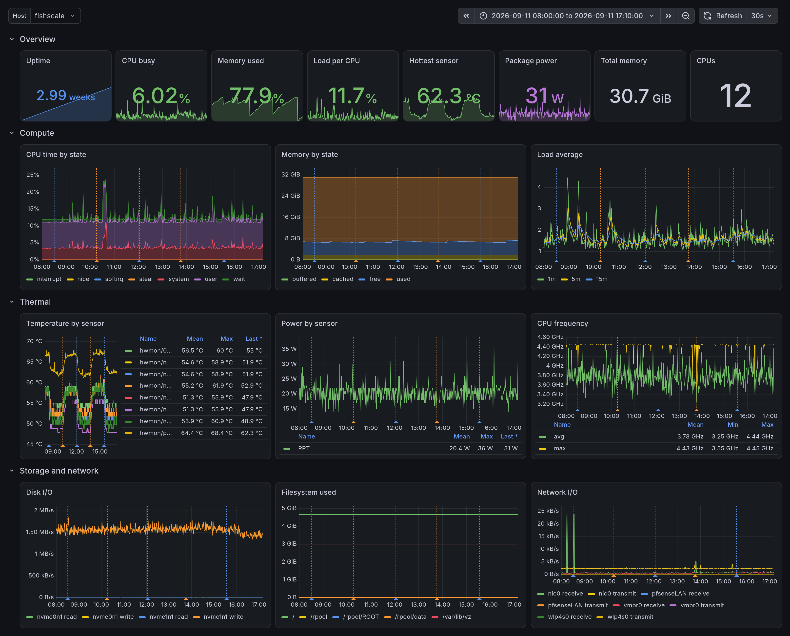
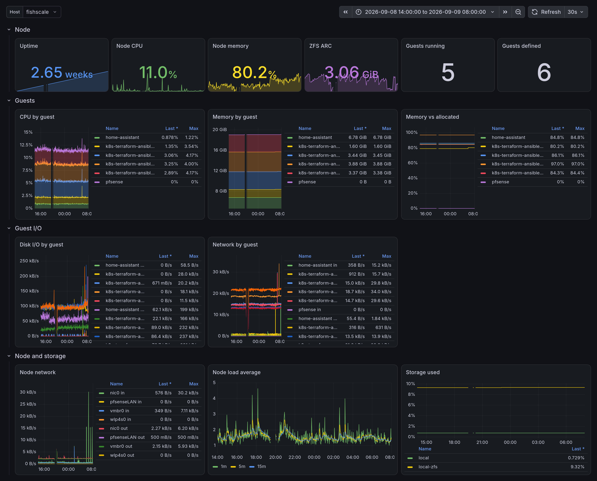

# Cooling a closet homelab

My homelab lives on one shelf in an apartment coat closet with no airflow. I added two USB fans, pointed across the gear.

To find out whether the fans were worth it, I needed numbers from before and after. This repo is the configuration that collects them: an OpenTelemetry Collector on the Proxmox node scraping Node Exporter over loopback, a second collector with Prometheus and Grafana in containers on my workstation, dashboards generated from jsonnet, and scripts to mark a change and average the windows either side of it.

## The coat closet

There's network gear in there too, so it's also a network closet. It's a minimal setup, and the rest of the lab is in storage until there's room for it.



What's in there:

- HP Elite Mini 805 G8 -- Proxmox node
- Dynalink AX3600 running OpenWrt
- NETGEAR GS305P
- UAP-AC-PRO
- Apple TV 4K -- for Home Assistant's HomeKit Bridge

An SLZB-MR2 hangs off the switch too -- PoE'd out to the living room through the panel.

It gets warm.

A rack with real ducting isn't happening in an apartment, so I looked at just pointing some fans at it. The idea came from [this home lab tour](https://www.youtube.com/watch?v=vktLEFH7t7c) by KTZ Systems, where he mentions in passing that he keeps small fans sat on top of gear that runs hot -- one of them added after an SFP+ NIC overheated and died.

Then came choosing the fans, and I spent too long on it. I reached for a Noctua offering first, but a case fan needs somewhere to sit, and an NF-A14 5V is overkill with a price tag to match. Instead, I went with an AC Infinity MULTIFAN S7: two 120mm fans, USB powered, speed controller on the cable, rubber feet.

The Elite Mini runs Proxmox VE, so it's a hypervisor with a handful of VMs on it. It's the busiest thing in the closet and the one whose temperature I care about, so it's what this repo instruments and what the graphs show. The OpenWrt router could report too, but the switch is unmanaged and the rest are closed boxes.

## The result

| change | hottest sensor | degrees per watt |
|--------|---------------:|-----------------:|
| off -> medium | **-4.46 °C** | -0.14 |
| medium -> high | -0.15 °C | -0.07 |
| off -> high | -4.76 °C | -0.26 |



Medium takes about 4.5 °C off the hottest sensor. High adds nothing on top of it: two untouched windows drift by ±0.4 °C on their own, so -0.15 °C is not a result. CPU load was identical across every window, so this is cooling rather than a quieter machine.

The blue band is the closet door, open while I fitted the fans. The gap before 20:30 is the workstation asleep. Every comparison above used windows clear of both.

## Architecture

Answering one question about a closet turned into a general OpenTelemetry metrics pipeline. Temperatures are just what I happened to be measuring; the same setup covers CPU, memory, disks and network on any Linux host. Proxmox adds the guests on top of that, and it's the only source that needs anything specific to it -- two transform statements and one dashboard. Anything else that speaks OTLP joins unchanged.

```
Proxmox node(s)
    |- OTel Collector ....... host metrics ........ OTLP/gRPC -> :4317
    |      `- Node Exporter on loopback, scraped locally
    `- PVE metric server .... cluster metrics ..... OTLP/HTTP -> :4318
                |
                v
Workstation (containers)
    `- OTel Collector -> Prometheus -> Grafana
```

The stack runs on a workstation, not on the machine it watches -- putting it there would add heat and load to the thing being measured. Everything pushes outbound, so nothing on a node has to accept connections or expose a port.

Three sources feed it:

- **PVE metric server.** Proxmox VE 9 ships an OpenTelemetry metric server, so VM, container and storage metrics need no exporter and no API token. It is configured once for the datacenter and sends OTLP/HTTP straight to the central collector.
- **OpenTelemetry Collector** on the node, configured with the `host_metrics` receiver: CPU, load, memory, paging, disk, filesystem, network and processes. This is the OS-level detail the PVE API does not expose.
- **Node Exporter**, bound to loopback and scraped by that same collector over `127.0.0.1`. The `host_metrics` receiver has no temperature scraper, so hwmon is the only path to the machine's temperature sensors and package power draw. The result above is built from those readings.

Because the last two overlap, Node Exporter keeps its default collectors *minus* the ones `host_metrics` already reports: cpu, loadavg, meminfo, diskstats, filesystem, netdev, stat, vmstat, time. Leaving them on would store every value twice under two naming schemes. The `systemd` collector is also off, for a different reason -- it emits one series per unit and grows with every guest on the host, which on a hypervisor can dominate the total. What remains is mostly what `host_metrics` cannot read: temperatures, PSI pressure, ZFS, EDAC, NVMe.

All three land on the central collector over OTLP and leave it as a single remote-write stream; Prometheus scrapes nothing at all. Grafana's datasource is provisioned from a file, so a fresh volume comes up already configured.

## The collector pipeline

### Where configuration lives

The node collector only does what has to happen on the node: declaring its own hostname and machine ID, scraping Node Exporter over loopback. Naming, filtering and limits live centrally, edited in one place instead of on every node, so node configs stay identical and rarely need touching.

Every metric passes through the central collector before storage, and senders cannot be trusted to conform. Three jobs, in pipeline order:

- **Admit.** Decide what is worth storing before spending effort on it. Prometheus exporters ship their own scrape scaffolding alongside the metrics themselves.
- **Normalize.** Rewrite foreign vocabularies into semantic conventions, and resolve sources that measure the same thing under different names.
- **Constrain.** Bound what conforming data can cost. Cardinality grows with use rather than with hardware, since every guest adds its own disk, network and VM series. `memory_limiter` caps what that can consume.

The tradeoff is that failures are quiet. With `error_mode: ignore`, a rule that matches nothing does nothing and logs nothing -- so verify a new transform against real data rather than assuming it applied.

### Normalizing toward semantic conventions

Only `host_metrics` speaks OpenTelemetry natively. Node Exporter and the PVE metric server each use their own vocabulary, so the central collector pulls them toward semantic conventions in one place.

Three rules cover most of it:

- **A host is not a service.** `service.*` describes an application. The prometheus receiver names each resource after its scrape job, so the node collector deletes that `service.name`. Sources that describe themselves, like PVE and the collectors, keep theirs.
- **Host identity.** A node declares its own `host.name`, `host.id`, and a `service.instance.id` derived from its machine ID, which survives restarts. PVE can't be configured, so the central collector copies its `proxmox.node` into `host.name` -- that's what lets PVE metrics join host metrics.
- **Hardware sensors.** `node_hwmon_temp_celsius{chip,sensor}` becomes `hw.temperature{hw.id,hw.sensor_location}`, with `min`/`max`/`crit` as `hw.temperature.limit`. `node_hwmon_power_watt` becomes `hw.power`; power is what makes a temperature reading mean anything, since degrees per watt separates a working fan from a lighter workload.

Dropping `service.name` costs the `job` label on host metrics. That's deliberate -- OpenTelemetry has no infrastructure equivalent, and the maintainers would rather the mapping gain a fallback than have hosts borrow `service.*` ([contrib#46207](https://github.com/open-telemetry/opentelemetry-collector-contrib/issues/46207)). Expect imported dashboards to need adjusting.

Other hwmon sensors are left alone: little to report for `hw.voltage`, no `hw.current` at all, and `hw.status` needs a data point per state, which the transform processor cannot produce from one reading.

Everything else keeps its upstream name. `proxmox_vm_*`, ZFS, PSI pressure and the detailed network counters have no convention to map onto -- `system.*` is still development-status and PSI is only a [proposal](https://github.com/open-telemetry/semantic-conventions/issues/2995), so inventing names now would produce metrics that look standard and aren't.

### Watching the collectors themselves

Both collectors report their own health -- data points accepted per receiver, sent or failed per exporter, queue depth, memory. Without it, a collector that stops forwarding looks identical to a quiet host.

A collector's internal telemetry is produced by its service layer rather than a receiver, so it never enters that collector's own pipeline. Each collector pushes it over OTLP instead of exposing a port for something to scrape: the node collectors to the central one, the central collector back into its own receiver. Only the nodes get real independence from that -- the central collector's own metrics leave through its one remote-write exporter, so if that fails the missing data is the signal.

`resource_detection` is a pipeline processor, so it never runs on self-telemetry. The node collector sets `host.name` and `host.id` on its own metrics instead, from environment variables systemd fills in with `%H` and `%m` -- which is what keeps the config identical on every node.

Useful signals: `otelcol_exporter_sent_metric_points_total` per exporter (flat means a node stopped forwarding), `otelcol_exporter_queue_size` against `otelcol_exporter_queue_capacity` (backpressure), and `otelcol_process_memory_rss_bytes` against the `memory_limiter` ceiling. Failure counters exist but are only emitted once something fails, so do not expect them on a healthy stack.

Only the collectors are watched this way -- they're the one thing that can break silently. Node Exporter's own counters describe the exporter rather than the machine, so `--web.disable-exporter-metrics` drops what it can and `filter/scaffolding` catches the rest. `up` stays: one series, and the only sign that an exporter has died rather than gone idle.

## Querying

OTLP names are rewritten on the way in: dots become underscores and unit suffixes are appended. `host.name` is queried as `host_name`, and `system.cpu.time` becomes `system_cpu_time_seconds_total`. Confirm names in the metric browser rather than assuming them.

```promql
max by (host_name) (hw_temperature_celsius)
sum by (state) (system_memory_usage_bytes{host_name="..."})
```

Every host metric carries `host.name`, `host.id`, and `os.type`, so the three sources can be filtered and joined the same way. Group by `host_name`; host metrics carry no `job` label, for the reason above.

## Dashboards

Two are provisioned. **Host Overview** covers OS-level metrics and hwmon sensors:



**Proxmox Overview** covers node, guest and storage state:



Both appear on first start -- there is nothing to import.

They are generated rather than hand-edited. The source is [grafonnet](https://github.com/grafana/grafonnet) jsonnet under `dashboards/`, rendered to the JSON Grafana reads:

```shell
make dashboards    # dashboards/*.jsonnet -> dashboards/rendered/*.json
make fmt/jsonnet   # format the jsonnet
make lint/jsonnet  # lint the jsonnet
```

Everything runs in the `grafana/tanka` container, so nothing needs installing locally. `make up` renders first, and a fresh clone needs no extra step.

`dashboards/rendered/` is bind-mounted into Grafana and polled every 15 seconds, so a re-render lands without a restart. It is gitignored along with `dashboards/vendor/` -- both are build output.

Dashboards are marked non-editable and `allowUiUpdates` is off, so the UI cannot drift from the source. Change the jsonnet.

The dashboard images in this README come from [grafana-image-renderer](https://github.com/grafana/grafana-image-renderer), which runs as part of the stack. Whole dashboards, plus any panel whose title matches `RENDER_PANELS`, are written to `docs/images/`:

```shell
make screenshots RENDER_FROM=now-6h RENDER_TO=now
```

## Measuring a change

Changes are recorded as Grafana annotations tagged `fan`, which Host Overview draws as a line across every panel.

```shell
make annotate ANNOTATION="fan on, medium"
make unannotate                              # delete every annotation carrying the tag
```

`ANNOTATION_AT` accepts anything GNU `date -d` parses, so a change can be recorded after the fact. `ANNOTATION_UNTIL` turns the mark into a shaded region, and `ANNOTATION_TAGS` adds tags beside the one the dashboard queries:

```shell
make annotate ANNOTATION="both fans at the switch" \
    ANNOTATION_TAGS="speed:medium" \
    ANNOTATION_AT="14:00" ANNOTATION_UNTIL="16:30"
```

`make compare` takes a window of time before the mark and a window after it, averages four metrics across each, and prints both sides with the difference:

- **hottest (C)** -- the warmest hwmon sensor on the host
- **degrees per watt** -- that sensor divided by package power
- **package (W)** -- what the CPU package is drawing
- **cpu busy** -- the share of CPU time that isn't idle

Every value is a mean over the raw samples in that window, and the sample counts in the header say how complete each window was. The last two are controls rather than results: a temperature drop only means something if the machine was doing comparable work on both sides.

```shell
make compare                     # 3h either side of the latest annotation
make compare COMPARE_SETTLE=0.5  # skip 30 minutes of settling after the change
```

`COMPARE_SETTLE` pushes the after window later, so a transient is measured as neither state. Run it once before changing anything -- two untouched windows still differ, and that difference is the bar the fans have to clear. It warns when a window has a gap in it.

## Setup

Both the stack and the Makefile's own tooling run in containers; the runtime defaults to `docker`, and `make up CONTAINER_RUNTIME=podman` works just as well. On the host itself only `curl` and `jq` are needed, by `make compare`, `make annotate` and `make screenshots`.

### 1. Start the workstation stack

```shell
make up
```

**Prometheus** http://localhost:9090 | **Grafana** http://localhost:3000 (admin/admin)

Prometheus keeps 7 days of metrics by default. `PROMETHEUS_RETENTION` takes any Prometheus duration:

```shell
make up PROMETHEUS_RETENTION=90d
```

### 2. Install Node Exporter on each node

```shell
NODE=<node-address>

ssh root@$NODE "apt-get update && apt-get install -y prometheus-node-exporter"

ssh root@$NODE "mkdir -p /etc/systemd/system/prometheus-node-exporter.service.d"
scp config/node/node-exporter-listen.conf \
    root@$NODE:/etc/systemd/system/prometheus-node-exporter.service.d/listen.conf

ssh root@$NODE "systemctl daemon-reload && systemctl restart prometheus-node-exporter"
```

Confirm sensors are present -- a count of `0` means this hardware exposes no hwmon data:

```shell
ssh root@$NODE "curl -s localhost:9100/metrics | grep -c node_hwmon_temp_celsius"
```

### 3. Install the OTel Collector on each node

Use the **contrib** distribution; the base build lacks the `host_metrics` receiver.

```shell
COLLECTOR=<workstation-address>
VERSION=0.159.0
DEB=otelcol-contrib_${VERSION}_linux_amd64.deb
URL=https://github.com/open-telemetry/opentelemetry-collector-releases/releases/download/v$VERSION

ssh root@$NODE "cd /tmp && wget -q $URL/$DEB $URL/$DEB.sha256 && \
    echo \"\$(cat $DEB.sha256)  $DEB\" | sha256sum -c - && \
    dpkg -i $DEB && rm $DEB $DEB.sha256"

scp config/node/otel-collector.yaml root@$NODE:/etc/otelcol-contrib/config.yaml

# The config reads COLLECTOR_ENDPOINT from the environment.
ssh root@$NODE "mkdir -p /etc/systemd/system/otelcol-contrib.service.d"
scp config/node/otelcol-endpoint.conf root@$NODE:/etc/systemd/system/otelcol-contrib.service.d/endpoint.conf
ssh root@$NODE "echo COLLECTOR_ENDPOINT=$COLLECTOR:4317 > /etc/otelcol-contrib/endpoint.env"

ssh root@$NODE "systemctl daemon-reload && systemctl restart otelcol-contrib"
```

Hostname is detected automatically, so the same config deploys unmodified to every node.

### 4. Enable the PVE metric server

Requires Proxmox VE 9. In the web UI:

**Datacenter** -> **Metric Server** -> **Add** -> **OpenTelemetry**

| Field | Value |
|-------|-------|
| Name | anything, e.g. `otel` |
| Server | `<workstation-address>` |
| Port | `4318` |
| Protocol | HTTP |
| Path | `/v1/metrics` |

Remaining defaults are fine. The collector does not serve TLS, so Protocol must be HTTP.

Datacenter-wide -- configure once, whatever the node count.

### 5. Verify

Open http://localhost:9090 and type `system_` in the query box. Host metrics should autocomplete within a minute.

## Troubleshooting

```shell
docker compose logs otel-collector     # workstation
journalctl -u otelcol-contrib -n 50    # node
ss -lntp | grep 9100                   # node_exporter listening?
nc -zv <workstation-address> 4317      # node can reach workstation?
```

If the node collector will not start, `COLLECTOR_ENDPOINT` is usually unset -- it exits with `requires a non-empty "endpoint"`. The value arrives by `EnvironmentFile`, so check `/etc/otelcol-contrib/endpoint.env` rather than `systemctl show`.

## Teardown

On the workstation, `make down` stops the stack but keeps the Prometheus and Grafana volumes. `make purge` takes those too, and the metrics with them.

```shell
make purge
```

On each node, `apt-get purge` rather than `remove`, so the configs under `/etc` go too. The systemd drop-ins, the endpoint env file and the queue directory belong to no package and must be deleted by hand.

```shell
ssh root@$NODE "apt-get purge -y otelcol-contrib prometheus-node-exporter && \
    rm -rf /etc/systemd/system/otelcol-contrib.service.d \
    /etc/systemd/system/prometheus-node-exporter.service.d \
    /etc/otelcol-contrib /var/lib/otelcol-contrib && \
    systemctl daemon-reload"
```

The `otelcol-contrib` and `prometheus` system users survive purging. Remove them with `userdel` if you want nothing left behind.
